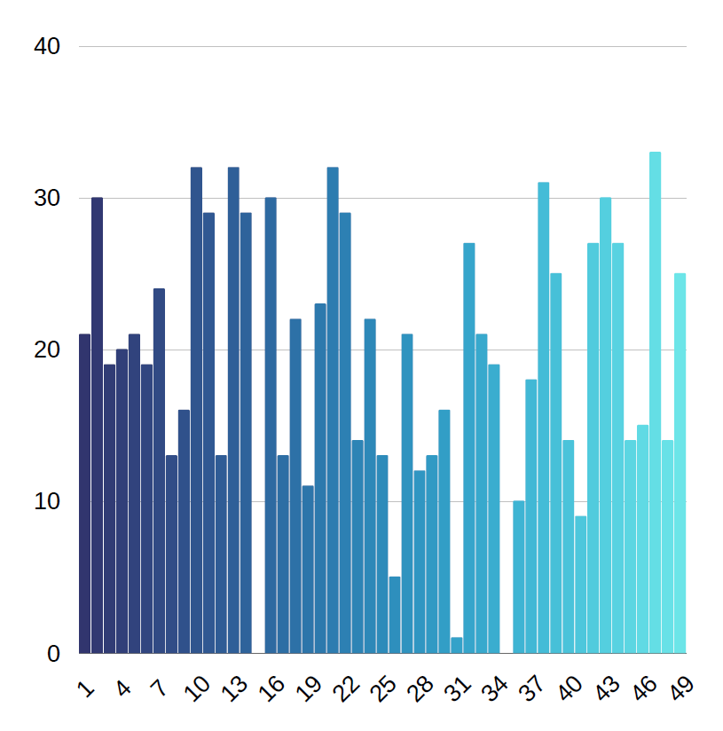
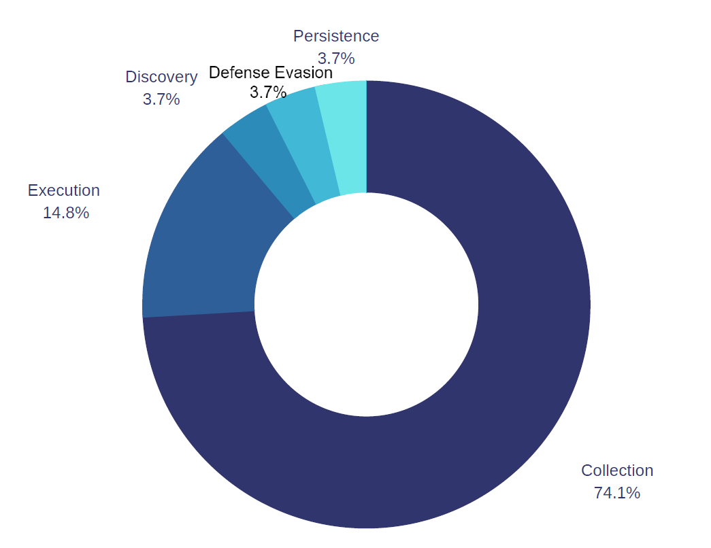

  Virustotal ve Hybrid Analysis sitelerini kullanarak yaptığım statik analizler sonucunda kaç tane virüs programının dosyayı tehdit olarak gördüğü,zararlının dosya türü, daha öncesinde analizini yapmış kişilerin etiketledikleri başlıklar ve yaptıkları yorumlar bu dosyların dinamik analizini yaparken beni yönlendirmesine yardımcı oldu.Aşağıdaki grafik statik analizini yaptığım 49 dosyanın 60 tane virüs programı içerisinden kaç tanesinin bunları tehdit olarak gördüğünü göstermektedir.

  Statik analizde elde ettiğim bulgulardan yola çıkarak linux tarafında Limon sandbox ve windows tarafında Intezer Analyze'ın online toollarını kullanarak bellek analizi, ağ trafiği ve kayıt defteri değişiklerini göz önüne alarak 21 dosyanın dinamik analizini yaptım. Yaptığım analizler sonucu elde ettiğim bulgularla zararlı yazılımları gruplandırarak aşağıdaki gibi bir grafik oluşturdum.

Dosya türlerinin büyük bir kısmını oluşturan collection sistemden veri çalmak için tasarlanmış yazılımlardır. Sistem dosyalarını, yerel veritabını gibi kaynakları kullanıp tarama yaparak, ekran görüntüsü veya klavye girişini kaydederek bu işlemi yapıyorlar.

Execution: Belirli bir kodu, scripti çalıştırarak yine sistemden bilgi çalmak veya ağı keşfetmek için yapılmış yazılımlardır.

Discovery: Bu grup ise collectiondan önce sistem hakkında bilgi toplamak için keşif amaçlı tasarlanmış yazılımlardır.

Defense Evasion: Yazılımın tespit edilmekten kaçınmak için kullandığı yöntemlerdir.Bunu yapmak için güvenlik yazılımını devre dışı bırakılması veya komut dosyalarının gizlenmesi gibi birçok farklı yöntem bulunuyor. Benim incelediğim yazılım ise bunu Windows kayıt defteri ile yapılandırma bilgilerini kayıt defteri anahtarının içerisine gizleyerek yapıyor.

Persistence: Sistemle olan bağlantısının olası kesintilerini engellemek için sistemde yerlerinin korunmasına izin veren tüm erişim ve yapılandırma değişikliklerini içeriyor. Analizini yaptığım yazılımda ssh'la uzaktan yönetim için anahtar tabanlı doğrulama kullanan sistemlerde ssh yapılandırma dosyasını düzenleyip, ssh keyi girip zararlı kendisini yetkilendirerek bu kalıcılığı sağlıyor.

